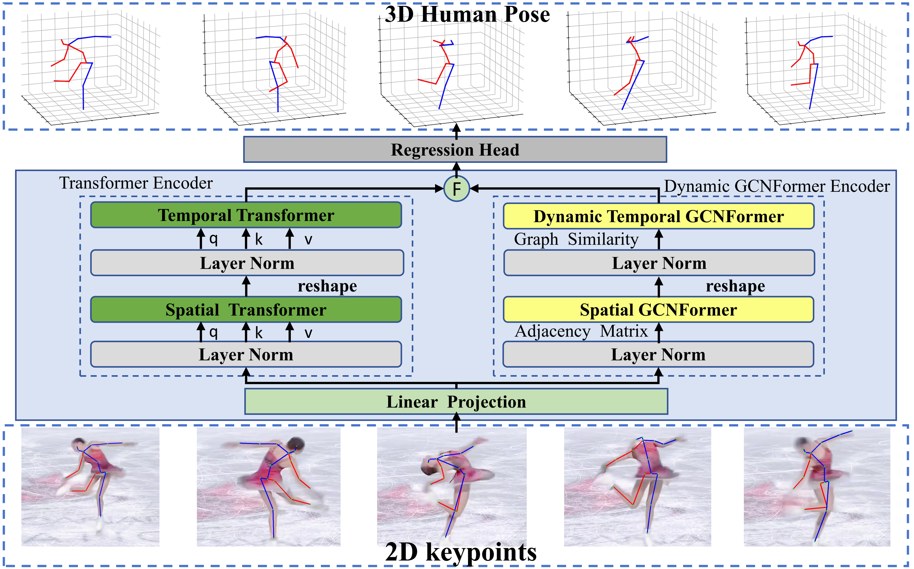

# DGT-Pose: Dynamic Skeleton-Aware Graph with Transformer for 3D Human Pose Estimation

Created by Xing Liu

Code will be released soon...


## Overview

<center>
    
    <br>
    <div style="color:orange; border-bottom: 1px solid #d9d9d9;
    display: inline-block;
    color: #999;
    padding: 2px;">
  	</div>
</center>

## Dependencies

Make sure you have the following dependencies installed (python):

- Python 3.8.10
- PyTorch 2.0.0
- CUDA 12.2

For installation of the project dependencies, please run:
```
pip install -r requirements.txt
``` 

You should download [MATLAB](https://www.mathworks.com/products/matlab-online.html) if you want to evaluate our model on MPI-INF-3DHP dataset.

## Datasets

Our model is evaluated on [Human3.6M](http://vision.imar.ro/human3.6m) and [MPI-INF-3DHP](https://vcai.mpi-inf.mpg.de/3dhp-dataset/) datasets. 

### Human3.6M

We set up the Human3.6M dataset in the same way as [VideoPose3D](https://github.com/facebookresearch/VideoPose3D/blob/master/DATASETS.md).  You can download the processed data from [here](https://drive.google.com/file/d/1FMgAf_I04GlweHMfgUKzB0CMwglxuwPe/view?usp=sharing).  `data_2d_h36m_gt.npz` is the ground truth of 2D keypoints. `data_2d_h36m_cpn_ft_h36m_dbb.npz` is the 2D keypoints obatined by [CPN](https://github.com/GengDavid/pytorch-cpn).  `data_3d_h36m.npz` is the ground truth of 3D human joints. Put them in the `./data` directory.

### MPI-INF-3DHP

We set up the MPI-INF-3DHP dataset following [P-STMO](https://github.com/paTRICK-swk/P-STMO). However, our training/testing data is different from theirs. They train and evaluate on 3D poses scaled to the height of the universal skeleton used by Human3.6M (officially called "univ_annot3"), while we use the ground truth 3D poses (officially called "annot3"). You can download our processed data from [here](https://drive.google.com/file/d/1zOM_CvLr4Ngv6Cupz1H-tt1A6bQPd_yg/view?usp=share_link). Put them in the `./data` directory. 
 
## Train and Test
SOON...

## Evaluation
SOON...


## Acknowledgement
Our code refers to the following repositories.
* [MotionDiffuse](https://github.com/mingyuan-zhang/MotionDiffuse)
* [D3DP](https://github.com/paTRICK-swk/D3DP)
* [MixSTE](https://github.com/JinluZhang1126/MixSTE)
* [MotionAGFormer](https://github.com/TaatiTeam/MotionAGFormer)

We thank the authors for releasing their codes.

